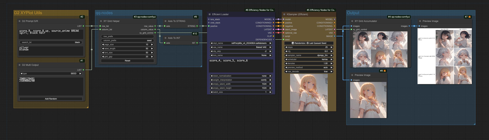
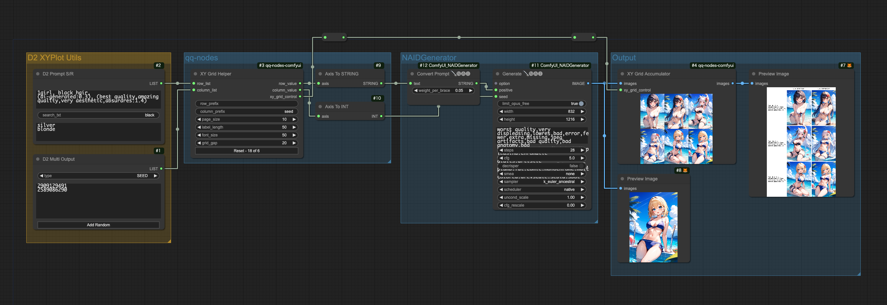
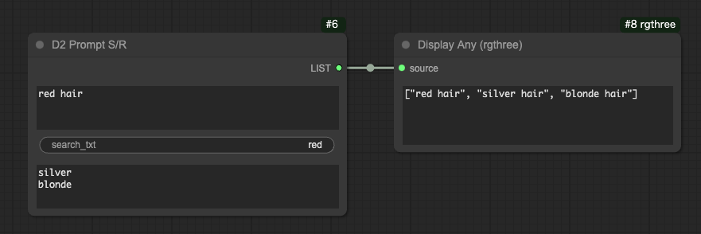
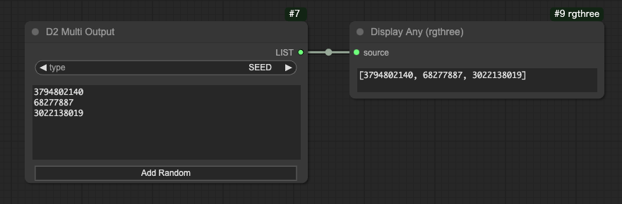

# D2 XYPlot Utils

- XY Plot で Prompt S/R を使うためのカスタムノード
- seed や cfg など汎用的なパラメータを記載するためのノードも同梱
- 要素を改行で区切るので操作が簡単
- XY Plotカスタムノード [qq-nodes-comfyui](https://github.com/kenjiqq/qq-nodes-comfyui) で使用することを前提としているが、他のカスタムノードでも使えるかもしれない

## サンプルワークフロー
画像を ComfyUI にドロップするとワークフローを再現できます。

SDXL の XY Plot
<a href="./img/XYPlot_SDXL_20240920.png"></a>

NovelAI の XY Plot
<a href="./img/XYPlot_NAI_20240920.png"></a>


## install

custom_nodes フォルダで `git clone` する
```
> git clone https://github.com/da2el-ai/ComfyUI-d2-xyplot-utils.git
```


## D2 Prompt S/R



### prompt
プロンプト。改行を含めてもOK。

### search_txt
検索対象テキスト。複数単語を含めてもOK。
改行は使えない。

### replace
置換用テキスト。
置換したいテキストを1行毎に記述。

## D2 Multi Output



### type
- FLOAT：浮動小数点数。CFGなど
- INT: 整数。stepsなど
- STRING: 文字列。samplerなど
- SEED: 乱数生成ボタンで seed値を入力できる

## 謝辞
qq-nodes-comfyui という素晴らしいカスタムノードを作ってくれた kenjiqq 氏に感謝。
