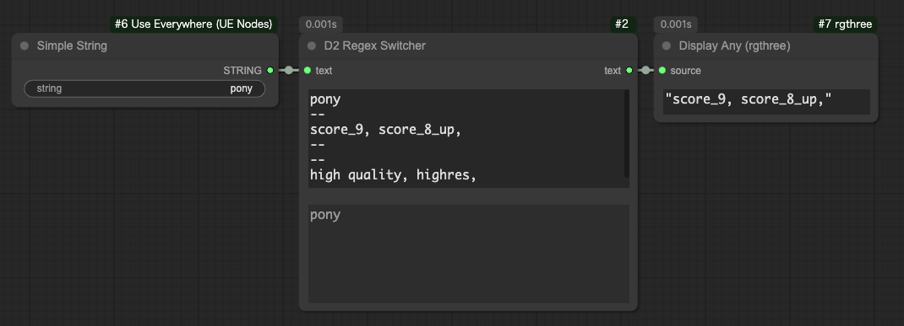

# D2 XYPlot Utils

[English][<a href="README_ja.md">日本語</a>][<a href="README_zh.md">繁体中文</a>]

- Custom nodes for using Prompt S/R with XY Plot
- Also includes nodes for listing general parameters such as seed and cfg
- Easy input with elements separated by line breaks
- Designed for use with the XY Plot custom node [qq-nodes-comfyui](https://github.com/kenjiqq/qq-nodes-comfyui), but may work with other custom nodes

## Sample Workflow
You can reproduce the workflow by dropping the image into ComfyUI.

XY Plot for SDXL
<a href="./img/XYPlot_SDXL_20240920.png"></a>

XY Plot for NovelAI
<a href="./img/XYPlot_NAI_20240920.png"></a>


## Installation Options

### 1. ComfyUI Manager Installation
ComfyUI Manager → Custom Node Manager → Search for D2 XYPlot and install

### 2. Git Pull Method
In the custom_nodes folder, use `git clone`:
```
> git clone https://github.com/da2el-ai/ComfyUI-d2-xyplot-utils.git
```


## D2 Prompt S/R


A node that searches and replaces strings and outputs a list.

### prompt
The prompt. Line breaks are acceptable.

### search_txt
Text to search for. Multiple words are allowed.
Line breaks are not supported.

### replace
Replacement text.
Write the text you want to replace, one line per replacement.


## D2 Multi Output


A node that outputs lists of numbers, strings, etc.

### type
- FLOAT: Floating-point numbers. For CFG, etc.
- INT: Integers. For steps, etc.
- STRING: Strings. For samplers, etc.
- SEED: Can input seed values with a random number generation button.

### Add Random
Displayed when `type` is `SEED`.
Adds random numbers to the input field.

## D2 Regex Switcher



The main purpose is to switch quality tags for each Checkpoint.
Outputs the target string and the index of the match (starting from 0) if a matching string is found in the input `text`.

In the image above, `animagine.safetensors` is received, and as it doesn't match the search condition `pony`, the default output `sdxl quality tag` is displayed.
As there's no match, the `index: -1` is shown.


### text
The text to search in.
For example, the full path of a Checkpoint.

### regex_and_output
A list of search strings and output strings.
Enter in the following format:

```
Search string 1 (regex can be used)
--
Output string 1
--
Search string 2 (regex can be used)
--
Output string 2
--
--
String to output when no match is found
```

### Text field added at the bottom during execution
For confirming the input `text`.

### Usage Example


In this example, the matched number (`index`) is passed to [Easy Use](https://github.com/yolain/ComfyUI-Easy-Use)'s "Text Index Switch" for switching.
To avoid getting `-1` when there's no match, a regex pattern `.+` that matches all strings is used as a default output.

## D2 Checkpoint Loader


A Checkpoint Loader that outputs the Checkpoint name, hash, and full path.
Used when the Checkpoint path is needed.

The implementation mostly uses code from [mikey_nodes](https://github.com/bash-j/mikey_nodes).

### model / clip / vae
Same as the conventional CheckpointLoader.

### ckpt_name / ckpt_hash / ckpt_fullpath
Checkpoint name, hash, and full path.

## Acknowledgments
Thanks to kenjiqq for creating the excellent custom node qq-nodes-comfyui.