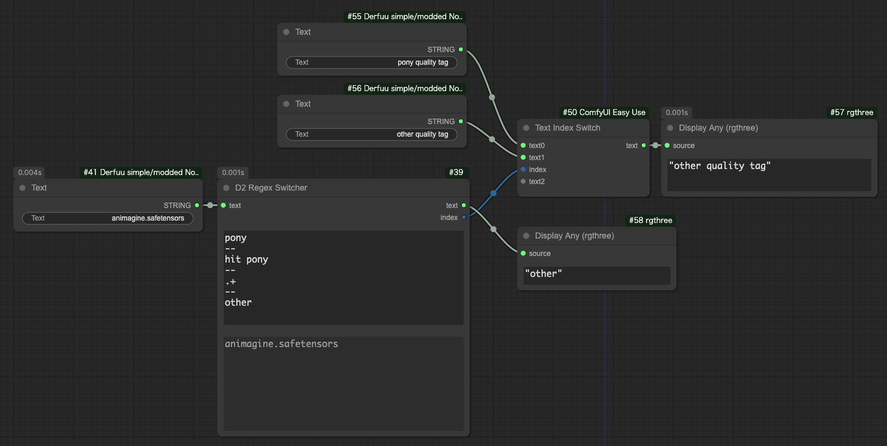

# D2 XYPlot Utils

- XY Plot で Prompt S/R を使うためのカスタムノード
- seed や cfg など汎用的なパラメータを記載するためのノードも同梱
- 要素を改行で区切るので入力が簡単
- XY Plotカスタムノード [qq-nodes-comfyui](https://github.com/kenjiqq/qq-nodes-comfyui) で使用することを前提としているが、他のカスタムノードでも使えるかもしれない

## Sample Workflow
画像を ComfyUI にドロップするとワークフローを再現できます。

SDXL の XY Plot
<a href="./img/XYPlot_SDXL_20240920.png"></a>

NovelAI の XY Plot
<a href="./img/XYPlot_NAI_20240920.png"></a>


## Installation Options

### 1. ComfyUI Manager Installation
ComfyUI Manager → Custom Node Manager → `D2 XYPlot` を検索してインストール

### 2. Git Pull Method
custom_nodes フォルダで `git clone` する
```
> git clone https://github.com/da2el-ai/ComfyUI-d2-xyplot-utils.git
```


## D2 Prompt S/R


文字列を検索・置換してリスト出力するノード。

### prompt
プロンプト。改行を含めてもOK。

### search_txt
検索対象テキスト。複数単語を含めてもOK。
改行は使えない。

### replace
置換用テキスト。
置換したいテキストを1行毎に記述。

## D2 Multi Output


数値、文字列などのリストを出力するノード。

### type
- FLOAT：浮動小数点数。CFGなど
- INT: 整数。stepsなど
- STRING: 文字列。samplerなど
- SEED: 乱数生成ボタンで seed値を入力できる

### Add Random

`type` が `SEED` の時に表示する。
入力欄に乱数を追加する。


## D2 Regex Switcher


主な目的は Checkpoint 毎にクオリティタグを切り替えるため。
入力した `text` の中に合致する文字列があると対象文字列と、何番目に合致したか（0から開始）を出力する。

上の画像では `animagine.safetensors` を受け取り、検索条件 `pony` に合致しないのでデフォルト出力の `sdxl quality tag` が出力されている。
検索条件に合致していないので `index: -1` になっている。

### text
検索対象文字列。
Checkpoint のフルパスなど。

### regex_and_output
検索文字列と出力文字列の一覧。
下記のフォーマットで記入する。

```
検索文字 1（正規表現も使用可能）
--
出力文字列 1
--
検索文字 2（正規表現も使用可能）
--
出力文字列 2
--
--
合致するものが無い時に出力する文字
```

### 実行時に追加される最下段の文字欄

入力された `text` の確認用。

### 使用例



この例では合致した番号（`index`）を Easy Use の Text Index Switch に渡して切り替えている。

合致しないと `-1` になってしまうので、全ての文字列に合致する正規表現 `.+` を使ってデフォルト出力の代わりにしている。


## D2 Checkpoint Loader


Checkpoint名、ハッシュ、フルパスを出力する Checkpoint Loader。
Checkpoint のパスが必要な時に使う。

実装はほとんど [mikey_nodes](https://github.com/bash-j/mikey_nodes) のコードを使わせていただきました。

### model / clip / vae
従来の CheckpointLoader と同じ。

### ckpt_name / ckpt_hash / ckpt_fullpath
Checkpoint名、ハッシュ、フルパス。


## 謝辞
qq-nodes-comfyui という素晴らしいカスタムノードを作ってくれた kenjiqq 氏に感謝。
