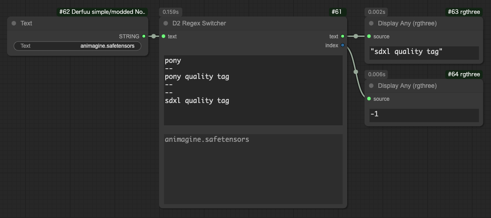
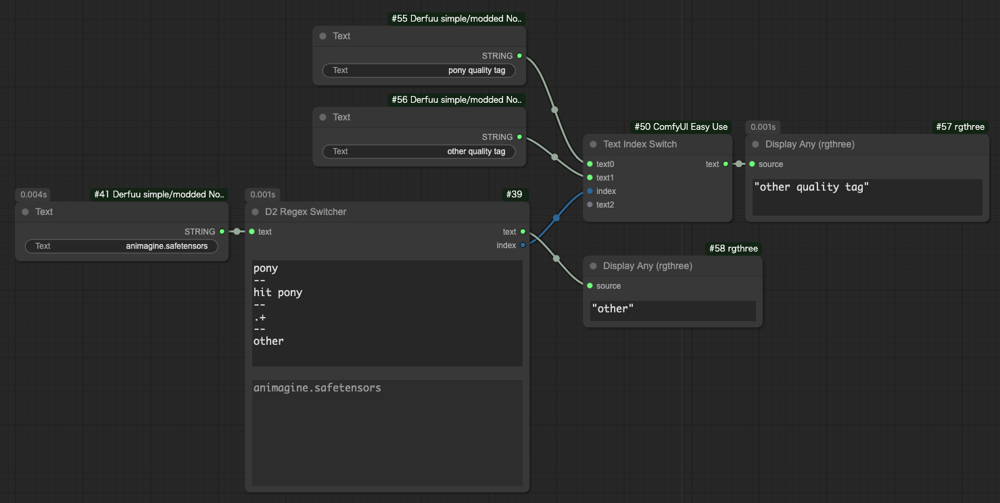
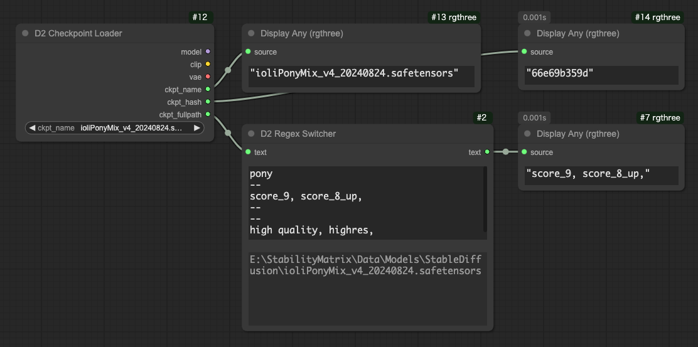

# D2 XYPlot Utils

[<a href="README.md">English</a>][<a href="README_ja.md">日本語</a>][繁体中文]

- 用於在XY Plot中使用Prompt S/R的自定義節點
- 還包含用於列出通用參數（如seed和cfg）的節點
- 使用換行符分隔元素，輸入簡單
- 設計用於XY Plot自定義節點 [qq-nodes-comfyui](https://github.com/kenjiqq/qq-nodes-comfyui)，但可能也適用於其他自定義節點


## 示例工作流程
將圖像拖放到ComfyUI中可以重現工作流程。

SDXL的XY Plot
<a href="./img/XYPlot_SDXL_20240920.png"></a>

NovelAI的XY Plot
<a href="./img/XYPlot_NAI_20240920.png"></a>


## 安裝選項

### 1. ComfyUI Manager 安裝
ComfyUI Manager → Custom Node Manager → 搜索 `D2 XYPlot` 並安裝

### 2. Git Pull 方法
在custom_nodes文件夾中使用 `git clone`：
```
> git clone https://github.com/da2el-ai/ComfyUI-d2-xyplot-utils.git
```


## D2 Prompt S/R


搜索和替換字符串並輸出列表的節點。

### prompt
提示詞。可以包含換行。

### search_txt
要搜索的文本。可以包含多個詞。
不支持換行。

### replace
替換文本。
每行寫一個要替換的文本。

## D2 Multi Output


輸出數字、字符串等列表的節點。

### type
- FLOAT：浮點數。用於CFG等
- INT：整數。用於steps等
- STRING：字符串。用於sampler等
- SEED：可以使用隨機數生成按鈕輸入seed值


### Add Random
當 `type` 為 `SEED` 時顯示。
在輸入欄中添加隨機數。


## D2 Regex Switcher



主要目的是為每個Checkpoint切換質量標籤。
如果在輸入的 `text` 中找到匹配的字符串，則輸出目標字符串和匹配的索引（從0開始）。

在上圖中，接收到 `animagine.safetensors`，由於不匹配搜索條件 `pony`，所以輸出默認的 `sdxl quality tag`。
由於沒有匹配，所以 `index: -1`。


### text
要搜索的文本。
例如，Checkpoint的完整路徑。

### regex_and_output
搜索字符串和輸出字符串的列表。
按以下格式輸入：

```
搜索字符串1（可以使用正則表達式）
--
輸出字符串1
--
搜索字符串2（可以使用正則表達式）
--
輸出字符串2
--
--
當沒有匹配時輸出的字符串
```

### 実行時に追加される最下段の文字欄

用於確認輸入的 `text` 。

### 使用例



この例では合致した番号（`index`）を [Easy Use](https://github.com/yolain/ComfyUI-Easy-Use) の Text Index Switch に渡して切り替えている。

在這個例子中，匹配的編號（`index`）被傳遞給 [Easy Use](https://github.com/yolain/ComfyUI-Easy-Use) 的 "Text Index Switch" 進行切換。

為了避免沒有匹配時得到 `-1`，使用匹配所有字符串的正則表達式 `.+` 作為默認輸出。


## D2 Checkpoint Loader



輸出Checkpoint名稱、哈希和完整路徑的Checkpoint Loader。
在需要Checkpoint路徑時使用。

實現主要使用了 [mikey_nodes](https://github.com/bash-j/mikey_nodes) 的代碼。

### model / clip / vae
與常規CheckpointLoader相同。

### ckpt_name / ckpt_hash / ckpt_fullpath
Checkpoint名稱、哈希和完整路徑。


## 致謝
感謝kenjiqq創建了優秀的自定義節點qq-nodes-comfyui。
